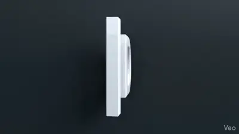
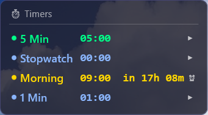
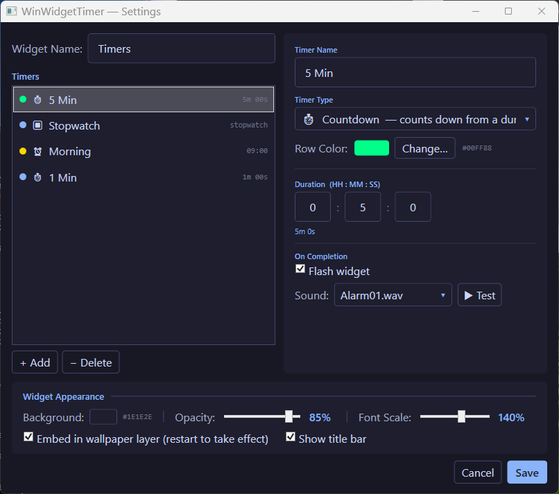

<table border="0">
  <tr>
    <td>
      17-May-2026<br>
      Windows<br>
      <a href="https://landenlabs.com/index.html">Home</a>
    </td>
    <td>
      <a href="https://landenlabs.com/index.html">
        
      </a>
    </td>
  </tr>
</table>

# WinWidgetTimer

[](https://github.com/landenlabs/win-widget-timer/actions/workflows/build.yml)


A lightweight Windows desktop timer widget that floats on your wallpaper as a transparent overlay.
Supports three independent timer types — countdown, stopwatch, and daily alarm — each with its own
color, sound, and flash-on-completion settings.

**By [LanDen Labs](https://github.com/landenlabs) (2026)**

---

## Screenshots

**Timer widget on desktop**



**Settings dialog**



---

## Features

- **Three timer types** — countdown, stopwatch (elapsed), and daily alarm in a single widget
- **Per-timer notifications** — individual sound file and flash-on-completion for each timer
- **Multiple widgets** — add as many independent timer groups as needed via the system tray
- **Transparent overlay** — sits directly on the desktop wallpaper, no taskbar clutter
- **Per-timer colors** — assign a custom color to each timer row
- **Drag to reorder** — reorder timers in the settings list via drag handle
- **Multi-monitor aware** — position saved per monitor layout; snaps to a safe position if the saved location is off-screen
- **Screen-map position picker** — drag a scaled widget marker across a miniature monitor map inside Settings to reposition the widget *(Windows 10 & 11 — see [Windows 10 notes](#windows-10-notes))*
- **Drag to reposition** — click and drag the widget anywhere on the desktop *(Windows 11)*
- **Background color & opacity** — live-preview color and transparency while Settings is open
- **Font scale** — adjust text size 50–200%
- **Show / hide title bar** — toggle the widget header on or off
- **Wallpaper embed mode** — render the widget at the wallpaper layer (below all windows)
- **Dark theme** — Catppuccin Mocha palette throughout
- **Persistent settings** — saved to `%AppData%\WinWidgetTimer\settings.json`

---

## Requirements

- Windows 10 or Windows 11
- [.NET 10.0 Desktop Runtime](https://dotnet.microsoft.com/en-us/download/dotnet/10.0) — install once; no SDK required

---

## Windows 10 Notes

### Drag limitation

On **Windows 10**, the desktop widget cannot be dragged directly on screen. This is caused by a Windows 10 incompatibility between WPF's `AllowsTransparency` and `WindowStyle="None"` — the combination that transparent widgets require. The drag operation silently fails.

**Windows 11** does not have this limitation; direct drag works normally.

### Workaround — Screen-map position picker

Open **Settings** (hover the widget and click ⚙, or right-click → Settings) and scroll to the **Widget Position** panel at the bottom:

```
Widget Position ─────────────────────────────── X: 120  Y: 200
┌──────────────────────────────────────────────────────────────┐
│  ┌────────────────────────────┐  ┌─────────────────────┐    │
│  │  Primary                   │  │  2560×1440          │    │
│  │        ▓▓▓▓▓               │  └─────────────────────┘    │
│  └────────────────────────────┘                              │
└──────────────────────────────────────────────────────────────┘
  Drag the blue marker to reposition the widget — it moves live.
```

- The canvas shows **all connected monitors** scaled to fit
- The **blue marker** represents the widget at its current position
- Drag the marker to the desired location — **the widget moves live** as you drag
- Click **Save** to keep the new position, or **Cancel** to restore it
- The X / Y coordinates update in real-time as you drag

This approach works on Windows 10 because the Settings dialog is a normal opaque window that does not require transparency.

---

## Installation

### Option A — Download release zip

1. Go to [Releases](https://github.com/landenlabs/win-widget-timer/releases)
2. Download `WinWidgetTimer.zip`
3. Extract to any folder (e.g. `C:\opt\bin\winwidgets\`)
4. Run `WinWidgetTimer.exe`

> The release zip contains a single self-contained `WinWidgetTimer.exe` plus an `Assets\` folder.  
> You must have [.NET 10.0 Desktop Runtime](https://dotnet.microsoft.com/en-us/download/dotnet/10.0) installed.

### Option B — Build from source

```cmd
git clone https://github.com/landenlabs/win-widget-timer.git
cd win-widget-timer
install.bat
```

The `install.bat` script publishes the project and copies the output to `C:\opt\bin\winwidgets\`.

---

## Usage

### Widget controls

| Action | Result |
|--------|--------|
| **Click timer row** | Start, pause, or reset that timer |
| **Hover** | Reveals ⚙ Settings and ? About buttons |
| **Drag** | Repositions the widget *(Windows 11 only — use Settings on Windows 10)* |
| **Right-click** | Opens context menu (Settings / About / Add / Remove / Exit) |

### Timer row icons

| Icon | State |
|------|-------|
| ▶ | Running |
| ⏸ | Paused |
| ↺ | Idle / reset |
| ✓ | Countdown complete |
| 🔔 | Alarm fired |

---

## Settings

Open Settings via the hover button or right-click menu.

### Timer list (left panel)

- **Widget Name** — label shown in the title bar and system tray
- **Timers** — all timers for this widget; click to select and edit
- **+ Add / − Delete** — add a new countdown timer or remove the selected one
- **Drag** the grip handle (⠿) to reorder timers

### Timer properties (right panel)

| Field | Description |
|-------|-------------|
| Timer Name | Display label for the row |
| Timer Type | Countdown, Elapsed, or Alarm (see below) |
| Row Color | Color of the dot and name text |
| Duration | HH : MM : SS — for Countdown timers |
| Alarm Schedule | Day of week + HH : MM — for Alarm timers |
| Time Format | Display format string (e.g. `HH:mm:ss` or `ddd HH:mm`) |
| Flash widget | Flashes the widget border red when the timer completes |
| Sound | WAV file from `C:\Windows\Media\` to play on completion |
| ▶ Test | Preview the selected sound immediately |

### Timer types

| Type | Icon | Behavior |
|------|------|----------|
| **Countdown** | ⏱ | Counts down from the configured duration to zero, then fires |
| **Elapsed** | ⏹ | Stopwatch — counts up from zero; click to start / pause / reset |
| **Alarm** | 🔔 | Fires once per day (or on a specific weekday) at the configured time |

### Widget Appearance (bottom panel)

| Setting | Description |
|---------|-------------|
| Background | Background fill color |
| Opacity | Background transparency 0–100% — updates live |
| Font Scale | Text size relative to default 50–200% — updates live |
| Embed in wallpaper layer | Anchors the widget behind all desktop icons (requires restart) |
| Show title bar | Toggles the widget name header |

### Widget Position (bottom of Settings — Windows 10 workaround)

A miniature map of your monitor layout. Drag the **blue marker** to move the widget anywhere on any screen. The widget repositions live as you drag. Coordinates are shown in the header. Changes are applied on **Save** and reverted on **Cancel**.

Settings are saved to `%APPDATA%\WinWidgetTimer\settings.json`.

---

## Building from Source

### Prerequisites

- [.NET 10 SDK](https://dotnet.microsoft.com/en-us/download/dotnet/10.0)
- Windows (WPF requires a Windows build host)

### Build

```cmd
dotnet build WinWidgetTimer.csproj -c Release
```

### Publish (FDD single-file, win-x64)

```cmd
dotnet publish WinWidgetTimer.csproj -c Release -r win-x64 --self-contained false -p:PublishSingleFile=true
```

Output: `bin\Release\net10.0-windows\win-x64\publish\`

This produces a **single `WinWidgetTimer.exe`** (all managed assemblies bundled) plus the `Assets\` folder. Users need only the .NET 10 Desktop Runtime — no SDK required.

### Build and install via batch script

```cmd
install.bat
```

Kills any running instance, publishes, and copies all files to `C:\opt\bin\winwidgets\`.

---

## Project Structure

```
WinWidgetTimer/
├── Models/
│   ├── AppSettings.cs       # Top-level settings (list of widgets)
│   ├── TimerEntry.cs        # Per-timer data model
│   └── WidgetSettings.cs    # Per-widget data model (position, timers, colors)
├── Services/
│   ├── DesktopService.cs    # Wallpaper embed / Win32 window helpers
│   ├── DisplayService.cs    # Per-monitor position save/restore
│   ├── SettingsService.cs   # Load/save settings.json
│   └── TrayIconService.cs   # System tray icon
├── ViewModels/
│   └── TimerDisplayItem.cs  # Live timer binding per row
├── Windows/
│   ├── AboutWindow.xaml     # About dialog
│   ├── ColorPickerWindow.xaml
│   ├── SettingsWindow.xaml  # Settings dialog (incl. screen-map position picker)
│   └── WidgetWindow.xaml    # Main widget overlay
├── Assets/
│   ├── landenlabs.mp4       # Animated logo (About dialog)
│   └── landenlabs.png       # Static logo fallback
└── install.bat              # Build and install script
```

---

## Credits

| Component | Source |
|-----------|--------|
| Timer logic | Custom countdown / stopwatch / alarm engine |
| Desktop embedding | Win32 `WorkerW` technique |

---

## License

Apache 2.0 © [LanDen Labs](https://github.com/landenlabs) 2026
